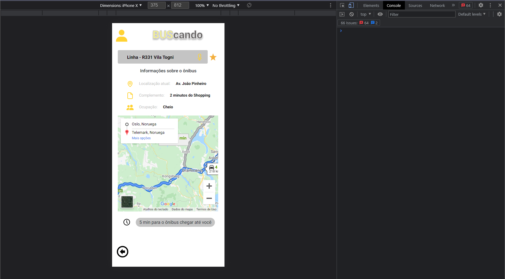

# Buscando

Aplicativo com o intuito de melhorar a visualização de rotas e acompanhamento das linhas, evitando a perda de tempo ou até mesmo perder o ônibus por conta dos horários de passagem deles.

## Visualização

Caso for abrir o aplicativo em um navegador Desktop, sugerimos que utilize a visualização mobile que se encontra em todos. Basta apertar F11 e selecionar o ícone de celular, ao lado da navegação de abas da ferramenta de desenvolvedor.

## Tecnologias

Foram utilizadas as mais básicas tecnologias de Front-end, como HTML e CSS puros.
Alguns estilos e funcionalidades, foi utilizado o Bootstrap5 para auxiliar, como o modal para inserção da rota ou a sidebar de navegação do usuário.